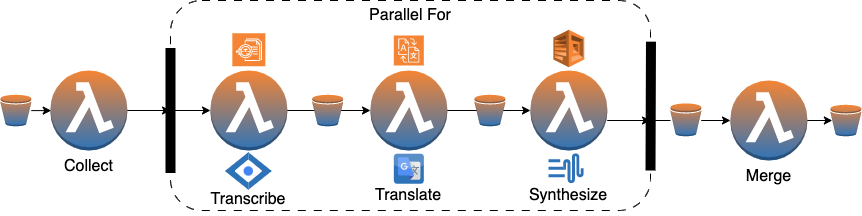
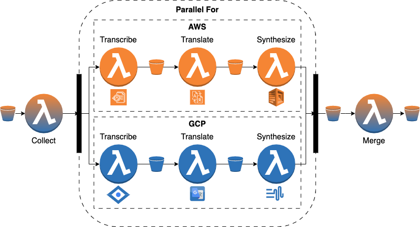

# speech-translator

# Workflow

The workflow orchestrates five functions: (F1)
**Collect** gathers the url’s of the files and counts them; (F2) **Transcribe**
transcribes an audio file and returns the transcript as plain text; (F3) **Translate** translates text from source
language
into target language; (F4) Synthesize converts
the text to natural sounding speech; (F5) **Merge** concatenates the audio files into a single file. All functions read
and write from and to cloud storage. All functions use cloud storage and the functions transcribe, translate and
synthesize use additional cloud services.



The workflow was distributed across two providers, which allows to overcome concurrency limitations of single
providers.



## Folder structure

[/collect](collect), [/transcribe](transcribe), [/translate](translate), [/synthesize](synthesize) and [/merge](merge)
are maven
modules, which contain the code for the serverless functions. [/workflow](workflow) contains the executable jar of the
xAFCL enactment engine, several workflows written in
AFCL and some json files, representing the workflow input. [/deployment](deployment) contains the terraform IaC scripts
for
deployment automation. [/samples](samples) holds some sample data, which can
be used for testing and debugging. [/docs](docs) contains some figures and documentation.

# Setup

Create a credentials.json file in the root folder of the project and insert the AWS and GCP credentials.

```
{
  "aws_credentials": {
    "accessKey": "",
    "secretKey": "",
    "token": ""
  },
  "gcp_credentials": {
    "type": "",
    "project_id": "",
    "private_key_id": "",
    "private_key": "",
    "client_email": "",
    "client_id": "",
    "auth_uri": "",
    "token_uri": "",
    "auth_provider_x509_cert_url": "",
    "client_x509_cert_url": ""
  }
}
```

Next, run the setup python script.

```bash
$ python setup.py
```

This will copy the credentials in all locations where they may be needed (e.g. Terraform, Functions, xAFCL).

Next, run the maven build. This uses the maven shade plugin to package all the code and the necessary dependencies into
jar archives (so-called "
fat" jars). Make sure that you installed the core library before, otherwise the build will fail.

```bash
$ mvn clean install
```

Finally, deploy the functions to both providers.

```bash
$ terraform init
$ terraform plan
$ terraform apply
```

# Execution

Change working directory.

```bash
$ cd workflow
```

Run the workflow on amazon:

```bash
java -jar ee.jar fc-amazon.yaml input-amazon.json
```

Run the workflow on google:

```bash
java -jar ee.jar fc-google.yaml input-google.json
```

Run the distributed version of the workflow:

```bash
java -jar ee.jar fc-distributed.yaml input-distributed.json
```

The warm-up-workflow invokes every function once and can be used to warm up all functions and avoid cold starts.

```bash
java -jar ee.jar fc-warumup.yaml input-warumup.json
```
